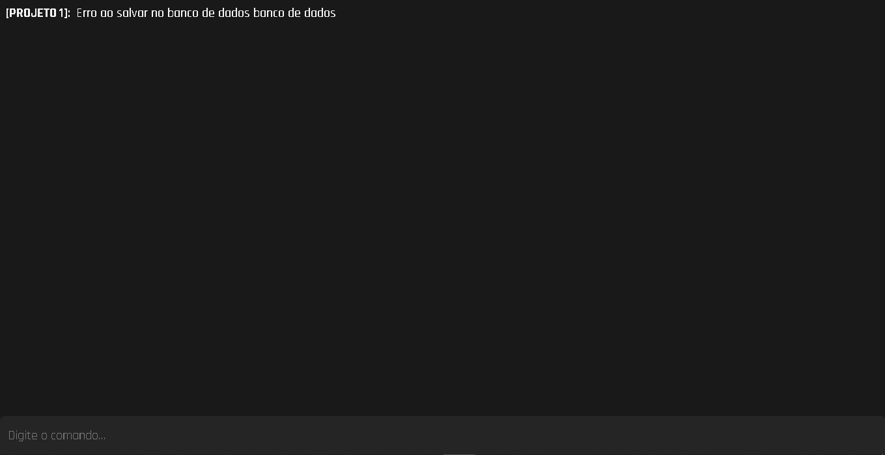
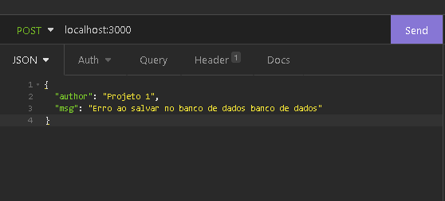

# Interface de comando WEB

## 🎯 Objetivo do projeto

Para os meus planos futuro preciso de uma interface de comandos capaz de juntar o console de todos os projetos e conseguir controlar algumas coisa

## 📅 Projeto atualmente

### Rota **_GET_** `/`

Interface do projeto

### Rota **_POST_** `/`

Recebe dados de outros projetos e passa para a interface

## ✨ Tecnologias usadas

-  Socket.io
-  Express
-  Ejs
-  Scss

## 📝 Próximas features

-  [ ] Backend salvar dados não vistos
-  [ ] Proteger rotas
-  [ ] Mostrar usuários conectados

## ⚙️ Como fazer funcionar

1. Clone o repositorio
2. Entre no arquivo pelo terminal
3. Digite `npm i` no terminal
4. Uso o nodemon globalmente mas pode instala-lo usando `npm i nodemon -D` e depois usar `nodemon` no terminal
